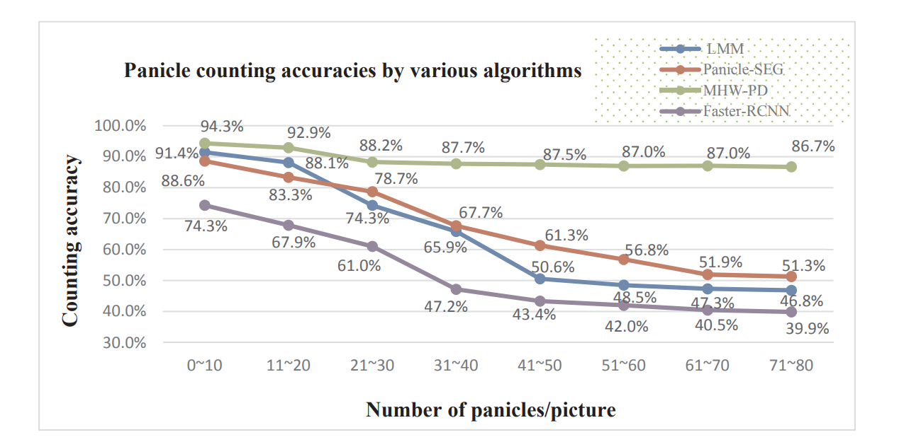

# Project2 for Group 8

## Team members

- Student name: Yang xiaoyuan, Xu shuyang, Zhang hengshun

## Keywords of the visualization

- Acuuracy
- Panicle Counting 
- MHW-PD

## A glimpse of the visualization

This visualization shows the variation of the accuracies of different classifiers. In this chart, the x-axis is the number of samples given to classifiers and the y-axis illustrates the accuracy of the algorithm. Users can discover the variation trend and the relationship of the size directly from the visualization.

## Why we choose this visualization

The middle and lower reaches of the Yangtze River is the origin of rice in China. Rice expanded from here and reached the Yellow River basin and areas south of the Yangtze River about 5000-4000 years ago.  During the Xia, Shang and Zhou dynasties, the cultivation area was further expanded to the upper reaches of the Yangtze River and the north of Yunnan-Guizhou and Yellow Rivers, basically forming a large pattern of ancient Chinese rice distribution. In the modern agricultural production that has completed industrialization, rice has became an important crop for Asia. The yield of cereal crops, such as rice, is largely determined by three agronomic indicators: the kernel number, the seed setting rate and the 1000-grain weight, in which the number of kernels per unit area is the most relevant agronomic traits to grain yield.  But in counting the number of kernels per unit area, automatic counting always have a colossal deviation. It’s a great obstacle for agricultural scientists to implement in-field assessment of rice panicle yields accurately and automatically, which is an important procedure to increase rice production. For other crops, automatic counting method based on machine vision technology has been used for years. However, counting the number of panicle need precise judgement for panicles, which unfortunately often droop due to their self-weight on the maturity-stage. As a result, the crowded panicles cram together with leaves and even occluded by leaves locally. What’s more, the size of the panicles in the image tends to reduce when high density of panicles is captured by the camera. So, scientists need to use effective method to extract the integrity of panicle feature in counting the number of panicles. 
In this paper, scientists give out a method named MHW-PD. This method chose a feature learning network with appropriate adjustment to give a better result. One of the drawbacks for partitioning the input image into sub-images is the panicle may be unintentionally cut into several parts in different sub-images. A simple way to correct this unintentional partition of the target object is to check the vicinity of all the predicted boxes. In this experiment, three other classifiers were used as controls. The abilities in terms of the averaged counting accuracies and error detection rates of all classifiers are plotted in the figure we chose. This figure shows a clear numerical trend, and the use of color is reasonable. For a line chart in a paper, it did so much to make the visualization better. But this figure also have some disadvantages. Some of the numbers in figure affect the look and feel, while some of the scales don't make sense. In this report, we will replicate this figure and adjust some elements, which will improve it on visualization.

## Our replication of the information visualization

## Detailed explanation of the information visualization

This figure gives the information about the counting accuracy of MHW-PD and other classifiers. In this figure, the x-axis illustrates the count of pictures of panicle, while the y-axis shows the counting accuracy. There are 4 broken lines in the figure, shown the accuracy changes of different algorithms. 
The accuracy of the new method, MHW-PD, remains highly steady in the whole figure, which is different from all others. The other three showed varying degrees of decline. The accuracy of Fast-RCNN is low in the whole process, because the act of dividing and deforming an image to a fixed size loses some of the images’ characters. The accuracies of the other two algorithms keep close when the number of pictures is below 20, but those of panicle-SEG and LMM decrease rapidly in the rest of this figure. These two models work poorly when applied to large amounts of data, the gap gradually widened from 20% to 30%. In the end, the accuracy of MHW-PD remains at 85%, but the accuracy of other algorithms are at about 50%.
For this visualization, it has some advantages.

1. It has removed data redundancy and randomness. Using broken-line chart and scales in 10s can furthest remove the data redundancy and randomness, also including missed data and NA values not marked.
2. It has a clear, self‐explanatory title. The title obviously show the content of this visualization, so readers can get the information in this visualization only by reading the title and legend.
3. No visual variables is used inappropriately to show data variation. 
4. Highlight what’s important. The color of important line is obvious in this visualization. It use bright color for the important line and dark colors for the other three lines in this chart. That 
5. Sort data for easier comparisons. The lines in this visualization shows the sort of data.
6. Line plots only for ordered variables.
7. Keeping it simple and using popular charts. The line chart is simple to read based on this data.

## Changes we proposed to improve the graph

To improve this visualization, we have adjusted some points on these aspects:

1. The label of y-axis. This label is hard to read for users in portrait. So we rotate it to crosswise. 
2. The y-coordinate. The y-coordinate was need to make comparison between data points, so it should starts at start at a meaningful baseline, which is 0 in this chart.
3. The legend. For the legend, the background points of this legend interfere with the visual effects, so we take them out. What’s more, to adjust the ratio of the length and width of this chart, we changed it from portrait to landscape.
4. The numerical label in this chart. With the scale lines in chart, the numerical label below the data point is not necessary, so we eliminate these labels in the chart.
5. Font size. The font size of titles should be larger than that of scale marks, which make it better to read.

Eliminated the impact of the increase in the number of rice panicles, this model gives a efficiently method to count the number of panicles in images. Since that the sub-image of each panicle is divided automatically, scientists can do more research on other features of panicles using this method in detail, such as the length of panicle, the radian of panicle, the number of panicle grains, the disease spot or the saturation of panicle grains and so on. However, that model also have some points for improvement. The result has shown quite clear that, when the target panicle is occluded by leaves, the detection is strongly affected by occlusions which causes degradation of panicle accuracies. But anyway, we can discover it obviously from this visualization that this method have great improvement on counting the number of panicles. 

## The final gragh that have been improved.

## Links

1. We have published this article to github, and the link is [improvement of visualization](https://github.com/yang-xiaoyuan/visualization-improvement.git).
2. The overt paper of where the visualization comes from is [paper](https://www.sciencedirect.com/science/article/pii/S016816991931991X).